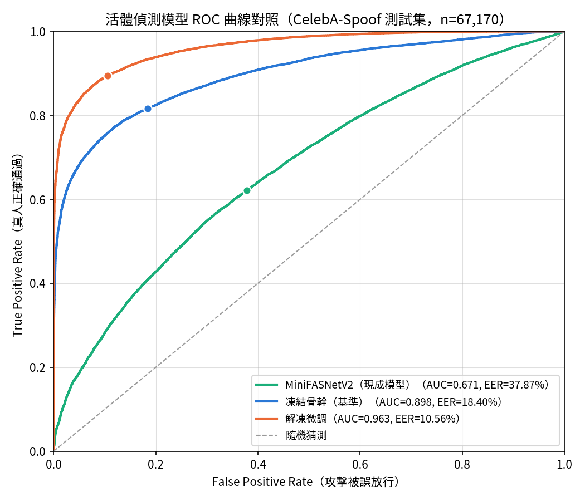

# Smart Access Agent System（智慧門禁代理系統）

只想快速把系統跑起來，見 [快速部署](./快速部署.md)。

## 專案簡介

本專案合併了兩個原本獨立的系統，統一放在同一個資料夾、共用一份 `requirements.txt`：

- **門禁子系統**（原 `My_Smart_Access_System`）：攝影機即時人臉辨識、自動打卡（上班／遲到／早退／下班）、YOLOv8 防尾隨偵測、語音播報、手機 QR Code 掃碼註冊。
- **RAG 法務助理子系統**（原 `Edge_LlamaIndex_RAG`）：本地端 LLM（透過 Ollama 執行 Qwen2-7B）驅動的問答系統，回答勞基法規定與即時考勤查詢，具備語意防護欄與自動化雙盲評估機制。

兩個子系統透過同一個 SQLite 資料庫（`database/database.db`）串接：門禁子系統負責寫入打卡紀錄，RAG 子系統即時查詢這份資料回答問題，不依賴靜態 CSV。

此外，`research/antispoof_training/` 底下是一個獨立的研究子專案：自行訓練一個以 MobileNetV3-Small 遷移學習的活體偵測（Presentation Attack Detection）模型，跟上線的正式程式碼完全分開，訓練完成後才會視評估結果決定是否與既有的 MiniFASNetV2 並存整合。

## 系統架構

### 門禁子系統

處理流程：攝影機輸入 → `vision_core.py`（`RetinaFace` 人臉偵測與對齊、`ArcFace R100` 萃取 512 維特徵向量）→ `database_mgr.py`（與資料庫內所有員工特徵計算歐氏距離，取最小值且低於門檻 `1.0` 者判定為該員工，並依時間窗寫入上班／遲到／早退／下班狀態）→ `security.py`（`YOLOv8s` 偵測放行瞬間是否人數 > 1，觸發尾隨警報並產生證據圖）→ 輸出至語音播報（`voice_agent.py` / `audio_player.py`，使用 sherpa-onnx）、`backend_main.py`（Tkinter 管理後台）與 `web_server.py`（Flask，供手機 QR Code 遠端註冊）。

活體偵測模型 `MiniFASNetV2` 已整合於 `vision_core.py`（`check_liveness`），但目前主流程尚未強制要求活體偵測通過才允許打卡。

`backend_main.py` 管理後台提供三個各自獨立、互不影響的服務開關：RAG（Ollama + LiteLLM + 助理網頁）、人臉辨識終端機、QR 註冊伺服器，啟動前會先偵測對應的網路埠是否已被占用，避免重複啟動。

### RAG 法務助理子系統

`main_guardrail_rag.py` 為統籌層，實際邏輯拆分為四個模組：

- `rag_index.py`：以 `FAISS` 建立 `data/laws/` 底下法規文件的向量索引（Embedding 模型為 `BGE-M3`），並持久化至 `faiss_storage/`。
- `rag_sql_engine.py`：對 `database/database.db` 的 `Attendance` 表進行唯讀即時 SQL 查詢（`Users` 表因含人臉特徵向量，刻意不開放查詢）。
- `rag_guardrail.py`：以對比式語意防護欄（查詢向量與「正向定義域」「負向定義域」計算餘弦相似度）過濾無關問題，並判斷問題該查考勤還是查法規。
- `rag_chat_engine.py`：建立帶對話記憶、套用 `LongContextReorder` 後處理的聊天引擎，僅用於法規類問題。

`evaluate_rag.py` 實作 LLM-as-a-Judge 自動化評估迴圈：由一個獨立的 API LLM（透過 LiteLLM Proxy）扮演出題官與裁判官，本地 Ollama（Qwen2-7B）扮演考生，依準確性、完整性、是否幻覺判定合格／不合格，並統計答題合格率、檢索命中率、幻覺率。

`ablation_config.py` / `run_ablation_suite.py` / `run_single_ablation_eval.py` 提供消融實驗框架，可個別關閉 LongContextReorder、語意防護欄、考勤路由關鍵字快速通道、確定性 SQL 查詢這四個機制，量化各自對答題品質的貢獻。

### research/antispoof_training（研究子專案）

以 ImageNet 預訓練的 MobileNetV3-Small 做遷移學習，訓練二分類（bona_fide / attack）活體偵測模型。支援三種資料來源：自行蒐集影片裁切（`prepare_dataset.py` + `split_dataset.py`，照人切分避免資料洩漏）、HuggingFace 精簡版 CelebA-Spoof（`prepare_celeba_spoof.py`）、官方完整版 CelebA-Spoof（`prepare_official_celeba_spoof.py`，以 manifest 方式讀取，不複製圖片、照人切分並排除訓練／測試集間的身分重疊）。`finetune_unfreeze.py` 提供第二階段部分解凍微調，`evaluate_antispoof.py` 計算 APCER／BPCER／ACER／EER 等 PAD 領域標準指標，`export_onnx.py` 匯出 ONNX 模型。詳見 `research/antispoof_training/README.md`。

## 活體偵測研究成果（Anti-Spoofing PAD）

以官方 CelebA-Spoof 測試集（67,170 張，19,923 真人 / 47,247 攻擊，依身分切分、與訓練／驗證集無重疊）評估，三方比較：正式系統目前在用的現成模型 `MiniFASNetV2`、自訓練骨幹完全凍結的基準版本、以及在此基礎上解凍最後 3 個 block 再微調的版本。

| | MiniFASNetV2（現成） | 凍結骨幹（基準） | 解凍微調 |
| --- | --- | --- | --- |
| 驗證準確率 | 不適用（非本專案訓練） | 0.9740 | 0.9940 |
| 測試集 EER | 37.87%（門檻 0.0193） | 18.40%（門檻 0.0579） | 10.56%（門檻 0.0012） |
| ROC AUC | 0.671 | 0.898 | 0.963 |



微調版的 EER 比現成的 MiniFASNetV2 低 72.1%（37.87% → 10.56%），凍結骨幹的基準版本也低 51.4%。這是合理的結果：MiniFASNetV2 是沒有在 CelebA-Spoof 上訓練過的現成模型，跨資料集評估（cross-dataset）本來就比在同一份資料集上訓練、驗證的模型吃虧，這正是這次自訓練活體偵測模型的動機——不是說 MiniFASNetV2 效果差，而是換一個資料集／場景後，沒有針對性訓練過的現成模型會出現明顯的泛化落差。APCER／BPCER／ACER／EER 依 ISO/IEC 30107-3 標準計算，完整的評估方法（各自 EER 門檻 vs. 固定門檻 0.5 的取捨、前處理跟 `vision_core.py` 的一致性驗證）見 `research/antispoof_training/README.md` 的「目前訓練結果」章節。

## 目錄結構

```
Smart_Access_Agent_System/
├── app.py                    RAG 助理：Gradio 網頁介面進入點
├── main_guardrail_rag.py     RAG 核心：統籌層
├── rag_index.py               法規向量索引（FAISS）
├── rag_sql_engine.py          考勤即時 SQL 查詢引擎
├── rag_guardrail.py           語意防護欄與路由分類
├── rag_chat_engine.py         法規對話引擎
├── evaluate_rag.py            RAG 自動化評估（LLM-as-a-Judge）
├── ablation_config.py         消融實驗開關設定
├── run_ablation_suite.py      消融實驗跑批主入口
├── run_single_ablation_eval.py 消融實驗單輪執行器
├── RAG.md                     RAG 部分技術文件
│
├── backend_main.py           門禁：Tkinter 管理後台（含三個服務開關）
├── service_manager.py         後台服務啟動/停止邏輯
├── console_panel.py           後台內建終端機元件
├── dashboard_stats.py         戰情儀表板統計查詢
├── account_admin.py           帳號管理（啟用/停用/刪除員工）
├── terminal_app.py           門禁：現場即時人臉辨識/打卡主程式
├── vision_core.py             人臉偵測、對齊、特徵萃取、活體偵測
├── security.py                 YOLO 防尾隨偵測與證據圖產生
├── database_mgr.py             打卡紀錄與員工特徵資料庫存取
├── voice_agent.py / audio_player.py  語音合成（TTS）
├── web_server.py               Flask：手機 QR Code 遠端註冊伺服器
├── utils.py                    中文字型繪製等通用工具
├── templates/register.html    員工自助註冊網頁
├── architecture.md              門禁系統技術文件
│
├── research/antispoof_training/  自訓練活體偵測模型研究子專案（獨立，見其自身 README）
│
├── data/laws/                  勞基法相關 PDF（RAG 法規知識庫來源，不進版控，需另外放入）
├── database/database.db        打卡紀錄資料庫
├── models/                     大型 AI 模型檔案（ArcFace、YOLOv8、MiniFASNetV2、TTS 模型等，不進版控）
├── anomaly_logs/                尾隨異常證據照片存放處（不進版控，含真實拍攝畫面）
│
├── config.yaml                  LiteLLM Proxy 路由設定
├── requirements.txt              統一依賴套件清單
├── pyproject.toml                Python 專案識別檔
└── 快速部署.md                  只想跑起來的最短安裝／啟動步驟
```

## 開發文件索引

系統架構的模組拆分細節、執行環境（虛擬環境、依賴套件、連接埠）說明見 [`docs/README.md`](./docs/README.md)。

## 安裝

確認 Python 版本為 3.10.x：

```bash
python -m venv venv
venv\Scripts\activate        # Windows
pip install -r requirements.txt
pip install retinaface --no-deps
```

`retinaface` 必須分成兩個指令、順序不能反：這個套件在 PyPI 上宣告要安裝 `tensorflow==2.5.0`，若與其他套件一起安裝，會覆蓋掉本專案需要的 `tensorflow==2.21.0`，因此 `requirements.txt` 中不含 `retinaface`，需在其他套件裝完後用 `--no-deps` 單獨補裝。

若有 NVIDIA 顯卡並已安裝對應版本的 CUDA Toolkit + cuDNN，可將 `requirements.txt` 中的 `onnxruntime==1.23.2` 改為 `onnxruntime-gpu==1.23.2`（兩者不可同時安裝）。

`models/` 資料夾內的大型模型檔案（`arcface_r100_v1.onnx`、`yolov8s.pt`、`MiniFASNetV2.onnx`、TTS 語音模型等，約 490MB）需另外取得，不隨版本控制提供。

`data/laws/` 底下的勞基法 PDF／`anomaly_logs/`（含真實尾隨偵測畫面）同樣不隨版本控制提供，前者需自行放入法規文件，後者留給系統執行時自動產生。

## 啟動方式

RAG 子系統評估功能所需的 LiteLLM Proxy 需要 Python 3.11 以上的獨立虛擬環境（litellm 目前所有相容 `openai` 2.x 的版本皆使用 `NotRequired`，此為 Python 3.11 才提供的語法，在 3.10 環境下會直接 `ImportError`），此步驟只需執行一次：

```bash
py -3.11 -m venv venv_litellm
venv_litellm\Scripts\activate
pip install "litellm[proxy]"
```

建立好環境後，回到主環境（`venv`，Python 3.10）啟動管理後台：

```bash
venv\Scripts\activate
python backend_main.py
```

管理後台畫面上方有三個各自獨立的服務開關：

- **啟動 RAG（Ollama + LiteLLM + 助理網頁）**：依序啟動 `ollama serve`、`litellm --config config.yaml`（使用 `venv_litellm`）、`app.py`（啟動後於瀏覽器開啟 `http://127.0.0.1:7860`）。
- **啟動人臉辨識終端機**：啟動 `terminal_app.py`，另開攝影機畫面視窗。
- **啟動 QR 註冊伺服器**：啟動 `web_server.py`，供主選單的「遠端 QR Code 註冊」使用。

## 已知限制

- 視覺核心目前依賴 Windows 內建的 `msjh.ttc`（微軟正黑體）進行中文渲染，跨平台需更換字體路徑。
- SQLite 在高併發寫入時可能觸發 `database is locked`。
- `RetinaFace` 在極低光環境下偵測率會下降，缺乏自動補光邏輯。
- `check_query_route()` 目前只分「純考勤」「純法規」兩類，同時涉及兩者的混合型問題（例如「遲到扣薪」）會被歸類到較相關的一類，尚未實作真正的聯合查詢。
- 考勤時間窗目前為固定設定，未套用每位員工各自的排班時間。
- `vision_core.py` 已實作活體偵測（`check_liveness`），但主流程尚未強制要求活體偵測通過才允許打卡。

更完整的技術細節與決策原因見 `architecture.md`（門禁子系統）與 `RAG.md`（RAG 子系統），專案進度記錄見 `project-status.md`。

## 授權

本專案僅用於邊緣 AI 與 RAG 安全性相關的教育及研究目的。
